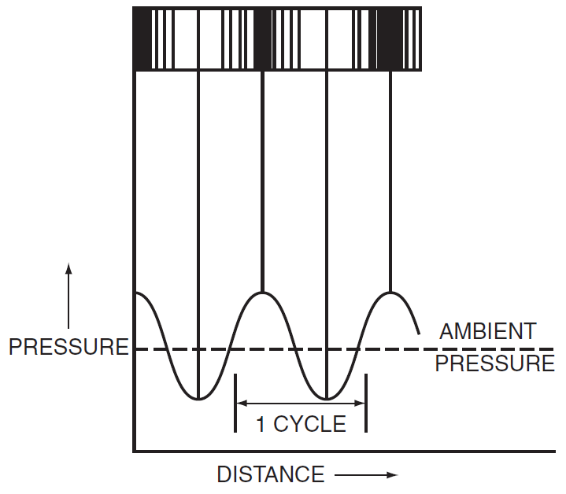

# 1 "声"的初步认识

### 1.1 定义

**[由物体振动产生的声波称之为声。](https://baike.baidu.com/item/%E5%A3%B0%E9%9F%B3/33686)** 从本质上讲，声波是一种 **机械波**，它必须依赖于介质进行传播，它是介质中质点振动状态的传播。 

### 1.2 声的主要应用

声学是一个很重要的基础和应用学科，它包含很多的学科方向，如物理声学、光声学、超声学、音频声学等。

它的应用领域也是很多的，如超声检测（B超）、超声探伤、换能器和传感器、水声通信、建筑声学、噪声等。不同的应用领域对声的研究方向有一定的差异性。

在日常生活中，我们也经常接触到“声”。耳朵就是接听声音的接收装置，人一般的听力范围为 **$20 \mathrm{Hz}\sim 20 \mathrm{kHz}$**，低于 $20 \mathrm{Hz}$ 的声音称为次声，高于 $20 \mathrm{kHz}$ 的声音成为超声。而且我们还可以听到汽车驶过时轮胎与路面摩擦产生的噪声、悦耳的音乐声、尖锐的知了叫声、刮风时的呼呼声。"声"时时刻刻就在我们的周围，让我们一起探索声音的世界吧。

### 1.3 声波的两种形式

（1）横波：声波的传播方向与质点振动方向垂直；
（2）纵波：声波的传播方向与质点振动方向一致。

声波在空气中和水中传播时，声波为纵波。因为空气和水都为 **[流体](https://baike.baidu.com/item/%E6%B5%81%E4%BD%93/1534061?fr=aladdin)**，静止状态下不存在切向力，只能存在法向力，所以只能是纵波。**大部分**介质中，声波为纵波。

横波即像水波传播的样子，存在切向力的介质中才有可能出现横波。**在固体中，一般横波和纵波是共存的。**

### 1.4 声场存在的两个必要条件

- **介质：声音的传播需要物质，物理学中把这样的物叫作声的介质。**
- **声源：机械振动的物体。**

这两个条件必须同时存在的情况下才有可能存在声场。没有介质是不行的，在真空中声音是不能传播的，因为声音的本质是机械波，那么他的传播是通过质点之间的相互作用传递波的振动形式，所以介质对于声波的存在和传播是必不可少的。

只有介质而没有声源的情况下，也不会存在声场。因为如果没有声源，那么介质中的质团的能量一直保持为一个常值，没有外界声源对其的干扰，所以不会产生声场。**人之所以能够听到声，是因为声压存在波动，声压的变化使我们的耳膜震动。**如果声压保持一常值，就好比我们处在一个环境大气压为常值的环境中，我们基本上是感受不到大气压的存在的。

### 1.5 声传播的本质

（1）纵波：纵波表现为介质的压缩和舒张。压缩时振幅为正，舒张时振幅为负，质点只在其平衡位置附近振动，并不会随着波传播。纵波的传播如图1所示，其波形形成如图2所示[^1]。

<b>图1 纵波传播示意图</b>

<b>图2 纵波波形示意图</b>

（2）横波：横波表现为质点在平衡位置上下振动，而声波沿振动的垂直方向传播，质点并不会随着声波传播。质点在某时刻的振动形态即为某时刻的波形。横波的传播如图3所示。

<b>图3 横波传播示意图</b>

**从两种波的传播形式可以看出，质点其实都没有随着波而传播，都在原位置附近振动。我们可以看出，质点的振动速度和声波的传播速度是两个完全不同的概念，其值相差也是很大的：质点的振速相对声波的传播速度来说是很小的，这一点将在后面的笔记中进行对比分析。**

[^1]:[Hodges R P. Underwater acoustics: Analysis, design and performance of sonar[M]. John Wiley & Sons, 2011: 4.](https://zz.glgoo.top/scholar?q=Hodges+R+P.+Underwater+acoustics%3A+Analysis%2C+design+and+performance+of+sonar%5BM%5D.+John+Wiley+%26+Sons%2C+2011%3A+4.)

