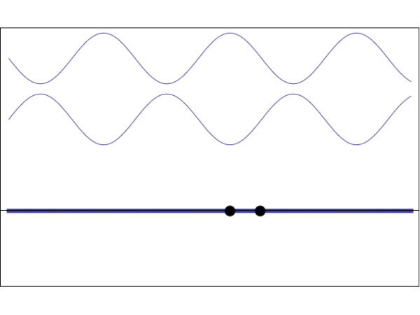
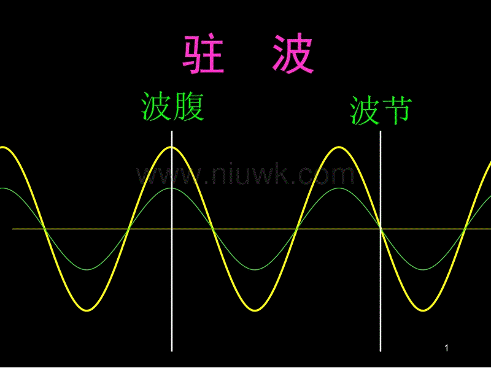

# 18 全反射与纯驻波场

## 18.1 全反射

根绝[平面波垂直通过分界面时的能量关系](./17-平面波垂直通过分界面时的能量关系.md)的内容，我们可以知道，无论是“绝对硬”边界还是“绝对软”边界，其在界面上都会发生全反射的现象。由于入射波和反射波频率相同、传播方向相反，会在入射波介质中形成[驻波](https://baike.baidu.com/item/%E9%A9%BB%E6%B3%A2/3004563?fr=aladdin)。

假设声波由`波疏介质` 入射到 `波密介质`，则会产生全反射现象，且边界为“绝对硬”边界。声压与质点振速的反射系数和透射系数分别为
$$
R_p \approx 1, R_u \approx = -1 \\
D_p \approx 2, D_u \approx 0
$$
产生驻波时，介质中的声压为
$$
p(x, t) = \tilde{p_i}+\tilde{p_r} = p_i^0 e^{j(\omega t - kx)} + p_r^0 e^{j(\omega t + kx)}
$$

## 18.2 半波损失

对于质点振速来说，反射波的质点振速的振幅与入射波的质点振速的振幅相等，符号相反，可表示为
$$
u_r^0 = - u_i^0
$$
假设入射波的质点振速满足 $u_i = u_i^0 e^{j(\omega t - kx)}$，则反射波的质点振速满足 $u_r = -u_i^0 e^{j(\omega t + kx)}$。而 $-1 = e^{j\pi}$，所以反射波的质点振速可表示为：
$$
u_r = u_i^0 e^{j(\omega t + kx + \pi)}
$$
可以发现，反射波质点振速相对于入射波质点振速，波形相位差为 $\pi$，这种现象叫做[半波损失](https://baike.baidu.com/item/%E5%8D%8A%E6%B3%A2%E6%8D%9F%E5%A4%B1/4259220?fr=aladdin)。`半波损失`只发生“绝对硬”界面，且只有反射波会存在半波损失，透射波是不存在半波损失的。当界面为硬界面时，会产生相位差，但是不是 $\pi$。

## 18.3 纯驻波场

对于“绝对硬”边界，其声压的反射系数约等于1，所以 $p_r^0 \approx p_i^0$，所以介质中的声压可表示为
$$
p(x, t) = p_i^0 e^{j(\omega t - kx)} + p_i^0 e^{j(\omega t + kx)} \\ = p_i^0 e^{j \omega t}(e^{jkx} + e^{-jkx}) \\ = p_i^0 \left[ \cos(\omega t) + j \sin(\omega t) \right] \left[ 2 \cdot \cos(kx) \right] \\ = 2p_i^0 \cos(\omega t) \cos(kx) + j \cdot 2p_i^0 \sin(\omega t) \cos(kx)
$$
根据欧拉公式 $\overrightarrow{u} = -\frac{1}{\rho_0}\int {\frac{\partial p}{\partial x}}dt$，可以得到介质中的质点振速为：
$$
u = -\frac{1}{\rho_0}jkp_i^0(e^{jkx - e^{-jkx}})\int{e^{j \omega t}}dt \\ = -\frac{p_i^0}{\rho_0 c_0} (e^{jkx} - e^{-jkx}) e^{j \omega t} \\
\frac{2p_i^0}{\rho_0 c_0} \sin(\omega t)sin(kx) - j\frac{2p_i^0}{\rho_0 c_0}cos(\omega t)sin(kx)
$$
对式（3）、（4）分别取实部，可得
$$
Re\{p(x, t)\} = 2p_i^0 \cos(\omega t) \cos(kx) \\
Re\{u(x, t)\} = \frac{2p_i^0}{\rho_0 c_0} \sin(\omega t)sin(kx) = \frac{2p_i^0}{\rho_0 c_0} \cos(\omega t - \frac{\pi}{2})sin(kx)
$$
式（7）表明声压和质点振速都是[驻波](https://baike.baidu.com/item/%E9%A9%BB%E6%B3%A2/3004563?fr=aladdin)。其中，$2p_i^0\cos(kx)$ 为驻波声压振幅，$\frac{2p_i^0}{\rho_0 c_0}\sin(kx)$ 为驻波质点振速振幅。

驻波动态图如图所示。其中横坐标为 $X$，纵坐标为振幅。从图中可以清晰地看出，质点只是在位置 $X$ 处上下振动，不会传播。

纯驻波场中，振幅最大的点叫[波腹](https://baike.baidu.com/item/%E6%B3%A2%E8%85%B9/887175?fr=aladdin)，振幅为零的点叫[波节](https://baike.baidu.com/item/%E6%B3%A2%E8%8A%82/887239?fr=aladdin)。其示意图如图所示。

在界面处，即 $x = 0$ 时，可得到
$$
\left. p(x, t) \right|_{x = 0} = 2p_i^0 \\
\left. u(x, t) \right|_{x = 0} = 0
$$
结果与 [16-平面波垂直入射](./16-平面波垂直入射.md) 中得到的结论是相同的。

## 18.4 声压驻波场和质点振速驻波场的特点

- 根据式（7）可以看出，两驻波场的相位差为 $\pi / 2$，表现为在同一位置上，声压驻波场为`波腹`，质点振速驻波场为`波节`，反之亦然。
- 在简谐声场中，声强取决于声压和振速的振幅值和它们之间的相位差，即 $I = \frac 1 2 pu \cos \phi$。由于声压驻波场和质点振速驻波场的相位差为 $\pi / 2$，所以声强处处为零，这意味着声场中的能量没有传播，只是动能和势能的形式存储在驻波场中。

