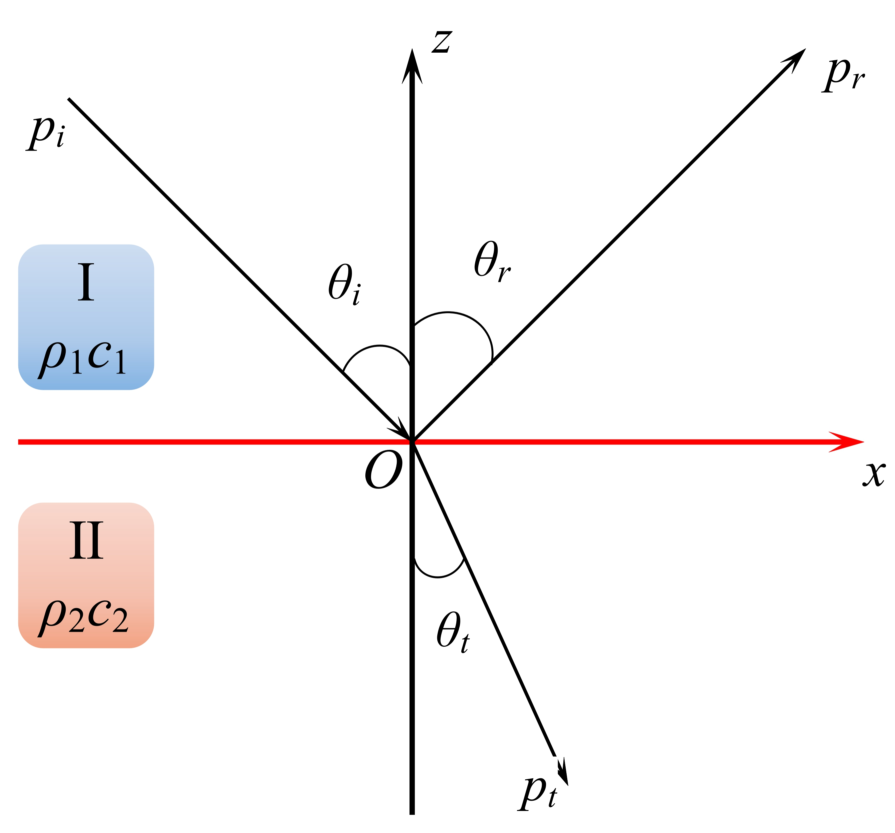
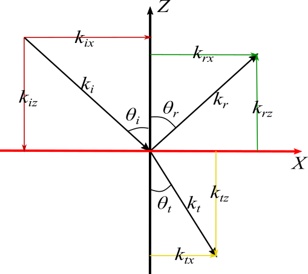

19 平面波倾斜入射

## 19.1 模型构建

<b>图1 平面波倾斜入射模型</b>

设上下有两种无限大介质，为介质 $\mathrm{I}$、介质 $\mathrm{II}$，其特性阻抗分别为 $\rho_1c_1、\rho_2c_2$。$z = 0$ 为两介质的分界面。平面波倾斜入射到分界面上发生了反射和折射，箭头所指的方向为声波传播方向。$\theta_i、\theta_r、\theta_t$ 分别为入射角、反射角和折射角，$p_i、p_r、p_t$ 分别为入射波声压、反射波声压和折射波声压。

根据两介质中的声压波动方程：
$$
\frac{\partial ^2 p_1}{\partial x^2} + \frac{\partial ^2 p_1}{\partial z^2} - \frac{1}{c_1^2}\frac{\partial ^2 p_1}{\partial t^2} = 0 \ \ \ \ (z \ge 0) \\
\frac{\partial ^2 p_2}{\partial x^2} + \frac{\partial ^2 p_2}{\partial z^2} - \frac{1}{c_2^2}\frac{\partial ^2 p_2}{\partial t^2} = 0 \ \ \ \ (z \le 0)
$$
由图1可以看出，上层介质中声压可表示为
$$
p_1(x, z, t) = p_i(x, z, t) + p_r(x, z, t) 
$$
下层介质中声压可表示为
$$
p_2(x, z, t) = p_t(x, z, t)
$$
根据边界条件——**声压连续、法向质点振速连续**，可得
$$
\left. p_1 \right|_{z = 0} = \left. p_2 \right|_{z = 0} \\
\left. u_{1n} \right|_{z = 0} = \left. u_{2n} \right|_{z = 0}
$$

## 19.2 根据声学边界条件求解

根据亥姆霍兹方程在直角坐标系下的解可得：
$$
p_i(x, z, t) = A_1 e^{j(\omega t - k_{ix}x - k_{iz}z)} \\
p_r(x, z, t) = A_2 e^{j(\omega t - k_{rx}x - k_{rz}z)} \\
p_t(x, z, t) = A_3 e^{j(\omega t - k_{tx}x - k_{tz}z)}
$$
然后对波数进行分解，如图2所示。

<b>图2 波数分解</b>

>根据波数分解图2所示，可得入射波的波数分解为
>$$
>k_{ix} = k_1 \sin \theta_i \\
>k_{iz} = -k_1 \cos \theta_i
>$$
>则入射波的声压方程可表示为
>$$
>p_i(x, z, t) = A_1 e^{j(\omega t - k_1 \sin \theta_ix + k_1 \cos \theta_i z)}
>$$

>根据波数分解图2所示，可得反射波的波数分解为
>$$
>k_{rx} = k_1 \sin \theta_r \\
>k_{rz} = k_1 \cos \theta_r
>$$
>则反射波的声压方程可表示为
>$$
>p_r(x, z, t) = A_2 e^{j(\omega t - k_1 \sin \theta_rx - k_1 \cos \theta_r z)}
>$$

>根据波数分解图2示，可得折射波的波数分解为
>$$
>k_{tx} = k_2 \sin \theta_t \\
>k_{tz} = -k_2 \cos \theta_t
>$$
>则折射波的声压方程可表示为
>$$
>p_t(x, z, t) = A_3 e^{j(\omega t - k_2 \sin \theta_tx + k_2 \cos \theta_t z)}
>$$

则介质 $\mathrm{I}$ 中声压方程为
$$
p_1(x, z, t) = p_i + p_r = A_1 e^{j(\omega t - k_1 \sin \theta_ix + k_1 \cos \theta_i z)} + A_2 e^{j(\omega t - k_1 \sin \theta_rx - k_1 \cos \theta_r z)}
$$
根据尤拉方程 $\overrightarrow{u} = -\frac{1}{\rho_0}\int \nabla p dt $，可得介质 $\mathrm{I}$ 法向质点振速为
$$
u_{1n}(x, z, t) = - \frac{1}{\rho_1}\int \frac{\partial p_1(x, z, t)}{\partial z}dt \\ 
= -\frac{1}{\rho_1 c_1} 
\left\{ 
A_1 e^{j(\omega t - k_1 \sin \theta_i x + k_1 \cos \theta_i z)} \cos \theta_i - A_2e^{j(\omega t - k_1 \sin \theta_r x - k_1 \cos \theta_r z) }\cos \theta_r
\right\}
$$
介质 $\mathrm{II}$ 中的声压方程为
$$
p_2(x, z, t) = A_3 e^{j(\omega t - k_2 \sin \theta_tx + k_2 \cos \theta_t z)}
$$
根据尤拉方程 $\overrightarrow{u} = -\frac{1}{\rho_0}\int \nabla p dt $，可得介质 $\mathrm{II}$ 法向质点振速为
$$
u_{2n}(x, z, t) = -\frac{1}{\rho_2}\int \frac{\partial p_2(x, z, t)}{\partial z}dt \\
= -\frac{1}{\rho_2 c_2}
\left\{
A_3 e^{j(\omega t - k_2 \sin \theta_t x + k_2 \cos \theta_t z)}\cos \theta_t
\right\}
$$
根据式（4）界面处声压连续和法向质点振速连续，可得：
$$
A_1 e^{-jk_1 \sin \theta_i x} + A_2 e^{-jk_1 \sin \theta_r x} = A_3 e^{-jk_2 \sin \theta_t x} \\
\frac{1}{\rho_1 c_1}
	\left(
		A_1e^{-jk_1 \sin \theta_i x}\cdot \cos \theta_i - A_2 e^{-jk_1 \sin \theta_r x}\cdot \cos \theta_r
	\right)
	= \frac{1}{\rho_2 c_2}
	\left(
		A_3 e^{-jk_2 \sin \theta_t x} \cdot \cos \theta_t
	\right)
$$
若式（16）对任何 $x$ 都成立，则等式中必须不包含 $x$ 项，即
$$
k_1 \sin \theta_i = k_1 \sin \theta_r = k_2 \sin \theta_t
$$

## 19.3 反射定律和折射定律

根据式（17）， $k_1 \sin \theta_i = k_1 \sin \theta_r$，则一定可以得到
$$
\theta_i = \theta_r
$$
式（18）表示**反射定律**。表述为：**入射角等于反射角**。其中，`入射角`表示入射方向与界面法线的夹角，`反射角`为反射方向与界面法线的夹角。

根据式（17）还可以得到 $k_1 \sin \theta_i = k_2 \sin \theta_t$，可以表示为
$$
\frac{\sin \theta_i}{c_1} = \frac{\sin \theta_t}{c_2}
$$
式（19）**[表示折射定律(Snell 定律)](https://baike.baidu.com/item/%E6%96%AF%E6%B6%85%E5%B0%94%E5%AE%9A%E5%BE%8B/2394669?fromtitle=%E6%8A%98%E5%B0%84%E5%AE%9A%E5%BE%8B&fromid=906357&fr=aladdin)**。

`折射定律`还可以表示为
$$
n_1 \sin \theta_1 = n_2 \sin \theta_2
$$
其中，$n_1、n_2$ 分别表示介质 $\mathrm{I}$ 和介质 $\mathrm{II}$ 的 **[折射率](https://baike.baidu.com/item/%E6%8A%98%E5%B0%84%E7%8E%87/788655?fr=aladdin)**，`折射率`有`绝对折射率`和`相对折射率`之分，`绝对折射率`的计算为 $n = \frac{c_0}{c}$，其中 $c_0$ 为参考速度。`相对折射率`的计算为 $n' = \frac{\sin \theta_1}{\sin \theta_2} = \frac{n_2}{n_1}$。

## 19.4 声压反射系数和声压折射系数

声压反射系数表示为
$$
R_p = 
\left.
	\frac{p_r(x, z, t)}{p_i(x, z, t)}
\right|_{z = 0} 
\left.
= \frac{A_2 e^{j(\omega t - k_1 \sin \theta_r x - k_1 \cos \theta_r z)}}
{A_1e^{j(\omega t - k_1 \sin \theta_i x + k_1 \cos \theta_i z)}}
\right|_{z = 0} = \frac{A_2}{A_1}
$$
声压折射系数表示为
$$
D_p = \left. \frac{p_t(x, z, t)}{p_i(x, z, t)} \right|_{z = 0}= 
\left.
\frac{A_3 e^{j(\omega t - k_2 \sin \theta_t x + k_2 \cos \theta_t z)}}
{A_1e^{j(\omega t - k_1 \sin \theta_i x + k_1 \cos \theta_i z)}}
\right|_{z = 0} = \frac{A_3}{A_1}
$$
式（16）可以简化为
$$
A_1 + A_2 = A_3 \\
\frac{A_1 \cos \theta_i - A_2 \cos \theta_r}{\rho_1 c_1} = \frac{A_3 \cos \theta_t}{\rho_2 c_2}
$$
两边同除以 $A_1$，可得
$$
1 + \frac{A_2}{A_1} = \frac{A_3}{A_1} \\
(\cos \theta_i - \frac{A_2}{A_1} \cos \theta_r)\frac{1}{\rho_1 c_1} = \frac{A_3}{A_1} \cos \theta_t \frac{1}{\rho_2 c_2}\\
\Downarrow
$$

$$
1 + R_p = D_p \\
(\cos \theta_i - R_p \cos \theta_r)\frac{1}{\rho_1 c_1} = D_p\cos\theta_t\frac{1}{\rho_2 c_2}
$$

解式（25）可得
$$
R_p = \frac{\rho_2 c_2 \cos \theta_i - \rho_1 c_1 \cos \theta_t}{\rho_2 c_2 \cos \theta_i + \rho_1 c_1 \cos \theta_t} = \frac{Z_2 - Z_1}{Z_2 + Z_1} \\
D_p = \frac{2\rho_2 c_2 \cos \theta_i}{\rho_2 c_2 \cos \theta_i + \rho_1 c_1 \cos \theta_t} = \frac{2Z_2}{Z_2 + Z_1}
$$
其中， $Z_1 = \rho_1 c_1 \cos \theta_t, Z_2 = \rho_2 c_2 \cos \theta_i$ 或 $Z_1 = \frac{\rho_1 c_1}{\cos \theta_i}, Z_2 = \frac{\rho_2 c_2}{\cos \theta_t}$。

令 $m = \rho_2/\rho_1,\  n = k_2 / k_1 = c_1 / c_2$，其中 $n$ 为相对折射系数。根据 Snell 法则，$\sin \theta_i = \frac{\sin \theta_t c_1}{c_2} = n \cdot \sin \theta_t$。

则声压反射系数和折射系数可表示为
$$
R_p = \frac{m \cos \theta_i - \sqrt{n^2 - \sin^2\theta_i}}{m \cos \theta_i + \sqrt{n^2 - \sin^2\theta_i}} \\
D_p = \frac{2m\cos\theta_i}{m \cos \theta_i - \sqrt{n^2 - \sin^2\theta_i}}
$$
式（26）（27）表明，**当声波倾斜入射时，声波的反射和折射不仅与两种介质的特性阻抗有关，还与入射角度有关。**

## 19.5 全折射

当 $R_p = 0$，即 $m^2 \cos^2\theta_i = n^2 - \sin^2 \theta_i$，此时反射波消失，入射波能量全部透入下层介质中，这种现象叫做`全折射(全透射)`。发生全折射时的入射角称为`全折射角`，记为 $\theta_0$，可用下式计算
$$
\theta_0 = \sin^{-1} \left( \sqrt{\frac{m^2 - n^2}{m^2 - 1}} \right)
$$
全折射存在的条件为
$$
\begin{cases}
\rho_2 c_2 > \rho_1 c_1 \\
c_1 > c_2
\end{cases}\\
\begin{cases} 
\rho_2 c_2 < \rho_1 c_1 \\
c_1 < c_2
\end{cases}
$$

## 19.6 全内反射

根据 Snell 法则 $\frac{\sin \theta_i}{c_1} = \frac{\sin \theta_t}{c_2}$，则

> 1.  $c_1 > c_2$ 时，$\theta_i > \theta_t$，$\theta_i$ 先于 $\theta_t$ 到达 $\pi / 2$，下层介质中一定会有折射波，不会发生全内反射。
> 2. $c_1 < c_2$时 ，$\theta_i < \theta_t$，$\theta_t$ 先于 $\theta_i$ 到达 $\pi / 2$，有可能发射全内反射。

**$c_1 < c_2$ 也是发生全内反射的必要条件。**

`临界角(Critical Angle)`：折射角 $\theta_t = \pi / 2$ 时的入射角 $\theta_i$ 称为临界角，记为 $\theta_c$。根据 Snell 法则，临界角可表示为
$$
\theta_c = \arcsin \frac{c_1}{c_2}
$$

当 $\theta_i > \theta_c \Rightarrow \sin \theta_i \ge \sin \theta_c = n \Rightarrow n^2 - \sin^2 \theta_i < 0$，此时声压反射系数为
$$
R_p = \frac{m \cos \theta_i - \sqrt{n^2 - \sin^2\theta_i}}{m \cos \theta_i + \sqrt{n^2 - \sin^2\theta_i}} = \frac{m \cos \theta_i + j\sqrt{\sin^2\theta_i - n^2}}{m \cos \theta_i - j\sqrt{\sin^2\theta_i - n^2}} = e^{j2\alpha}
$$
其中，$\alpha = \arctan \frac{\sqrt{\sin ^2 \theta_i - n^2}}{m \cos \theta_i}$。$\sqrt{-1} = -j$ ，原因位于下一节中。

**当 $\theta_i \ge \theta_c$ 时，$\left| R_p \right| = 1$。则发射声压幅值与入射声压幅值相等，发射声强与入射声强相等，反射声波能量等于入射声波能量。** 

## 19.7 下层介质中的波场

全内反射发生时，下层介质中会出现特殊的声场：**[非均匀平面波](https://baike.baidu.com/item/%E4%B8%8D%E5%9D%87%E5%8C%80%E5%B9%B3%E9%9D%A2%E6%B3%A2/8771712?fr=aladdin)**。

下层介质中的波场可以表示为
$$
p_t(x, z, t) = A_3 e^{j(\omega t - k_2 \sin \theta_t x + l_2 \cos \theta_t z)} 
= A_1 D_p e^{j(\omega t - k_2 \sin \theta_t x + l_2 \cos \theta_t z)}
$$
因为 $D_p = 1 + R_p$，所以折射系数可以表示为
$$
D_p = 1 + R_p = 1 + e^{j2 \alpha} = (e^{-j \alpha} + e^{j \alpha}) e^{j \alpha} = 2 \cos \alpha \cdot e^{j \alpha}
$$
而
$$
k_2 \sin \theta_t = k_1 \sin \theta_i \\
k_2 \cos \theta_t = k_2 \sqrt{1 - \sin ^2 \theta_t} = k_1 \sqrt{n^2 - \sin^2 \theta_i} = (\pm j)k_1 \sqrt{\sin ^2 \theta_i - n^2}
$$
所以下层介质中的波场可以表示为
$$
p_t(x, z, t) = A_1 D_p e^{j(\omega t - k_2 \sin \theta_t x + l_2 \cos \theta_t z)}\\
= 2 A_1 \cos \alpha \cdot e^{j \alpha}e^{j \left( \omega t - k_1 \sin \theta_i x \pm j k_1 \sqrt{\sin^2 \theta_i - n^2}z \right)} \\
= 2 A_1 \cos \alpha \cdot e^{\mp k_1 \sqrt{\sin^2 \theta_i - n^2}z}e^{j(\omega t - k_1 \sin_i x + \alpha)}
$$
根据`辐射条件`，即无穷远处声压为零，则
$$
\lim_{z \to -\infty} e^{\mp k_1 \sqrt{\sin^2 \theta_i - n^2}z} = 0
$$
所以应该取==正号==， 可确定下层介质中的声场为
$$
p_t(x, z, t) = 2 A_1 \cos \alpha \cdot e^{k_1 \sqrt{\sin^2 \theta_i - n^2}z}e^{j(\omega t - k_1 \sin_i x + \alpha)}
$$
式（37）表示 **非均匀谐和平面波场**。**等相位面垂直于 $x$ 轴，波沿 $x$ 轴正向传播，沿 $z$ 轴方向幅值不均匀（指数型衰减）**。

从式（37）中可以看出，非均匀平面波在下层介质中具有以下特性：

> 1. **非均匀折射波并不向下层介质中传播能量，即下层介质中 $z$ 方向能流平均值为零。**
> 2. **全内反射时，折射波声能沿 $x$ 方向传播，没有 $z$ 方向分量，折射波传播一段后又回到上层介质中，仍有能量守恒关系。**

---

为什么全折射或全内反射的条件是式（29），下面我们来推导一下。

>1. 首先假设 $c_1 > c_2$，则 $n = c_1 / c_2 > 1$。
>
>   根据式（28），则全折射角一定满足下式：
> $$
>   \sin ^2 \theta_0 = \frac{m^2 - n^2}{m^2 - 1} \in (0, 1)
> $$
>   当 $\sin ^2 \theta_0 = 1$ 时，$\frac{m^2 - n^2}{m^2 - 1} = 1 \Rightarrow n = 1$，这与假设条件不符。即使假设 $n = 1$ 的情况存在，那么 $\theta_0 = \pi / 2$，即垂直入射的情况下会发生全透射的现象，则一定 $\rho_2 c_2 = \rho_1 c_1$，又因为 $n = 1 \Rightarrow c_1 = c_2$，所以可得到 $\rho_1 = \rho_2$，两种介质的密度相等、波速相等，那么这两种介质就是相同的介质，根本不存在界面。所以，$n \ne 1$。
>
>   设 $\frac{m^2 - n^2}{m^2 - 1} = a, \forall a \in(0, 1)$，则密度比可表示为
> $$
>   m^2 = \frac{n^2 - a}{1 - a}
> $$
>   可以看出，$m > 1$。
>
>   要想发生全透射现象，则一定存在 $\theta_0 \in (0, \frac{\pi}{2})$，所以
> $$
>   \frac{m^2 - n^2}{m^2 - 1} > 0 \\
>   \because m > 1 \ \ \& \ \ n > 1 \\
>   \therefore m^2 > n^2 \Rightarrow m > n > 1
> $$
>   根据式（26），发射全折射现象时，一定满足公式 $\rho_2 c_2 \cos \theta_0 = \rho_1 c_1 \theta_t$，根据 Snell 法则，$\frac{\sin \theta_0}{\sin \theta_t} = \frac{c_1}{c_2} = n > 1 \Rightarrow 0 < \theta_t < \theta_0 < \pi / 2 \Rightarrow \cos \theta_0 < \cos \theta_t$，进而得到 $\rho_1 c_1 < \rho_2 c_2$。这个结论和 $m > n$ 是相同的，因为方程两边同时除以 $\rho_1 c_2$，即可得到 $m > n$。
>
>   将所有的条件进行综合，可得，在条件式（41）满足时，可发生全折射现象。
> $$
>   m > n > 1 \\
>   或\\
>   c_1 > c_2 \ \ \& \ \ \rho_1 c_1 < \rho_2 c_2
> $$

> 2. 根据上面的推理方法，可得到当 $c_1 < c_2$ 时，发生全透射现象是应满足的条件为
>    $$
>    0 < m < n < 1 \\
>    或\\
>    c_1 < c_2 \ \ \&\ \ \rho_1 c_1 > \rho_2 c_2
>    $$

