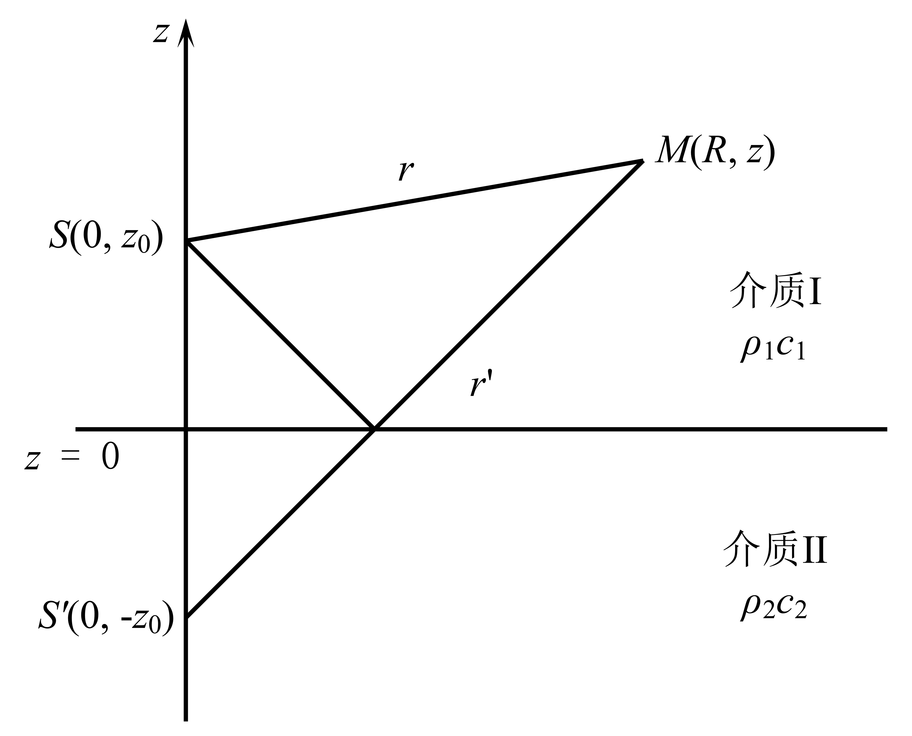

# 23 球面波在两种介质分界面上的反射

球面波的反射在一定条件下可用射线声学（几何声学）求解，适用条件是：**声源和接收点（观测的场点）据反射面的距离比波长大许多。**

使用镜像法求解球面波的反射，$M$ 点观察，声源 $S$ 在界面上的反射如同虚源 $S'$ 在 $M$ 点的场，虚源 $S'$ 在声源 $S$ 的 `镜像` 位置。如图1所示。

<b>图1 球面波反射模型</b>

根据球面波的声压模型，$M$ 点的声场可表示为：
$$
p(R, z, t) = \frac{A}{r} e^{j(\omega t - kr)} + \frac{B}{r}e^{j(\omega t - kr')}
$$
其中，$\begin{cases}r = \sqrt{R^2 + (z - z_0)^2}\\ r' = \sqrt{R^2 + (z + z_0)^2} \end{cases}$，$A、B$ 的值由界面的边界条件决定。

## 13.1 “绝对软”边界（声压释放边界）

对于“绝对软”边界，其界面处的声压为零。则
$$
\left . p(R, z, t) \right|_{z = 0} = \left. \frac{A}{r'} e^{j(\omega t - kr)} \right|_{z = 0} + \left. \frac{B}{r}e^{j(\omega t - kr')} \right|_{z = 0} = 0 \\
\Downarrow \\
A = -B
$$
则球面波的总声压场为
$$
p(R, z, t) = A\left[ \frac{1}{r} e^{j(\omega t - kr)} - \frac{1}{r'}e^{j(\omega t - kr')} \right]
$$
式（3）表示[声偶极子](ttps://baike.baidu.com/item/%E5%81%B6%E6%9E%81%E5%AD%90/9821501?fr=aladdin)辐射声场，如图2所示。

<b>图2 声偶极子</b>

## 13.2 “绝对硬”边界

对于“绝对硬”边界，其界面处的质点振速为零。则
$$
\begin{CD}
\left . \frac{\partial}{\partial z}\left[ p(R, z, t) \right] \right|_{z = 0} = 0 \\
@VVV \\
\frac{\partial p}{\partial r} \cdot \frac{\partial r}{\partial z} + \frac{\partial p}{\partial r'} \cdot \frac{\partial r'}{\partial z} = 0 \\
@VVV \\
\begin{cases}
	\frac{\partial p}{\partial r} \cdot \frac{\partial r}{\partial z} = 
	\left[ 
		-\frac{A}{r^2}e^{j(\omega t - kr)} + \frac{A}{r}\cdot -jk \cdot e^{j(\omega t - kr)}
	\right] \frac{1}{2r} \cdot (2z - 2 z_0) \\
	\frac{\partial p}{\partial r'} \cdot \frac{\partial r'}{\partial z} =
	\left[ 
		-\frac{B}{r'^2}e^{j(\omega t - kr')} + \frac{B}{r'}\cdot -jk \cdot e^{j(\omega t - kr')}
	\right] \frac{1}{2r'} \cdot (2z + 2 z_0) \\
\end{cases} \\
@VVV \\
A= B
\end{CD}
$$
则球面波的总声压场为
$$
p(R, z, t) = A\left[ \frac{1}{r} e^{j(\omega t - kr)} + \frac{1}{r'}e^{j(\omega t - kr')} \right]
$$
式（5）表示两个相同振动形式相同的点声源辐射声场，如图3所示。

<b>图3 同性极子</b>

