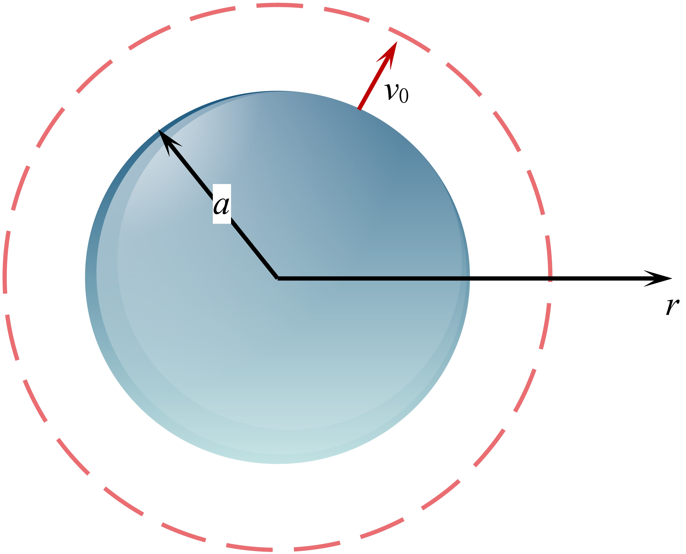
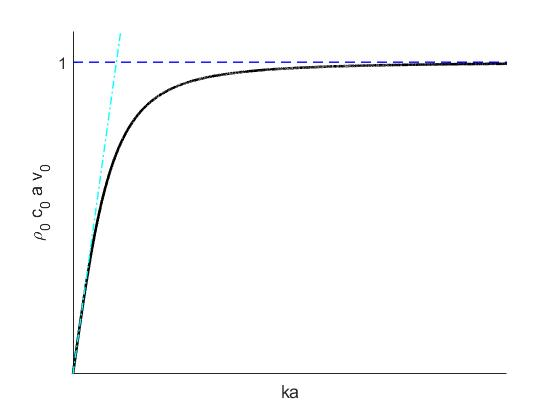

# 27 脉动球源声辐射

## 27.1 均匀脉动球源声辐射

<b>图1 脉动球源辐射示意图</b>

脉动球源声辐射模型满足：

1. **波动方程（亥姆霍兹方程）；**

2. **声场在辐射器表面的法向振速等于辐射器表面振速；**

3. **声波传播到无穷远处消失。**

则数学模型为：
$$
\begin{cases}
		\nabla^2 p(\overrightarrow{r}) + k^2 p(\overrightarrow{r}) = 0 \\
		\left. u_n(\overrightarrow{r}) \right|_{r = a} = v_0 \\
		\left. p(\overrightarrow{r}) \right|_{\overrightarrow{r} \to \infty} = 0
	\end{cases}
$$
因为介质是各向同性的，且辐射源为球形，所以声场与角度 $\theta, \ \phi$ 关，只与传播距离有关。

根据 [22-球面波](./22-球面波.md) 内容，可得其声压函数为：
$$
p(r, t) = \frac{A}{r}e^{j(\omega t - kr)}
$$
根据欧拉方程 $u = -\frac{1}{\rho_0}\int \nabla p dt$，可得质点振速方程为：
$$
u(r, t) = \frac{1 + jkr}{jkr \rho_0 c_0} \frac{A}{r} e^{j(\omega t - kr)}
$$
根据球表面的边界条件可得
$$
\left. u(r, t) \right|_{r = a} = v_0 e^{j \omega t} \ \ \ \ \ \
\Rightarrow \\
A = \frac{j\rho_0 c_0 a v_0 (ka)}{1 + jka}e^{jka} = \frac{\rho_0 c_0 a v_0 (ka)}{\sqrt{1 + (ka)^2}}e^{j(ka + \phi)}, \ \ \ \tan \phi = \frac{1}{ka}
$$
声压 $A$ 与 $ka$ 的关系图如图2所示。

<b>图2 声压A与ka关系图</b>

$$
A= \begin{cases}
\rho_0 c_0 a v_0 & \text{ka $\gg$ 1} \\
\rho_0 c_0 v_0 ka^2 & \text{ka $\ll$ 1}
\end{cases}
$$
由图2可得出以下结论：

**1. 球源大小一定时，辐射频率越高，辐射声压越大；辐射频率越低，辐射声压越小。**

**2. 辐射一定频率的声波时，球源半径越大，辐射声压越大；球源半径越小，辐射声压越小。**

## 27.2 均匀脉动球源的辐射阻抗和辐射声功率

> 辐射阻抗的定义为：
> $$
> Z_s = \int\int_{S_0} \frac{Z_a(\overrightarrow{r}) v(s)}{U_0}ds = R_s + jX_s
> $$
> 其中，$R_s$ 为辐射阻，$X_s$ 为辐射抗。

> 辐射器的辐射阻抗与辐射器的振动表面及其振速分布、介质的特性阻抗以及系统的参考点选择有关。
>
> `辐射阻`：“耗能”元件，将机械振动系统中的机械振动能转化为声场中的声能，所以，辐射阻的消耗功率就是辐射器的辐射声功率。
>
> `辐射抗`：“储能”元件，不断进行机械振动系统中的机械振动能与声场中声能的相互转化。
>
> `辐射声功率`：机械系统对介质做功的功率，即机械能中转换为相应声能的功率。
>
> 辐射声功率定义为：
> $$
> W_a = \frac{1}{2}R_s \left| U_0 \right|^2
> $$

### 27.2.1 辐射阻抗

根据 [22-球面波](./22-球面波.md) 可知，球面波的波阻抗为：
$$
Z_a(r, t) = \frac{jkr}{1 + jkr} \rho_0 c_0
$$
则均匀脉动球源的辐射阻抗为：
$$
Z_s(\omega) = \int\int_{S_0} \left. Z_a(r, t) \right|_S \frac{v(s)}{U_0}ds \\
= \left. \int \int_{S_0} \frac{jkr}{1 + jkr} \rho_0 c_0 \right|_{r = a} \frac{v_0}{v_0}ds \\
= 4 \pi a^2 \rho_0 c_0 \frac{jka}{1 + jka} \\
= 4 \pi a^2 \rho_0 c_0 
\left\{ 
	\frac{(ka)^2}{a + (ka)^2} + j \frac{ka}{1 + (ka)^2}
\right\} 
$$
其中，$R_s = 4 \pi a^2 \cdot \frac{(ka)^2}{a + (ka)^2} \rho_0 c_0, \ X_s = 4 \pi a^2 \cdot \frac{ka}{1 + (ka)^2} \rho_0 c_0$。其变化规律与 [22-球面波](./22-球面波.md) 中 `球面波波阻抗（波阻和波抗）`的变化趋势是相同的。

> 1. 大球辐射时，$a \gg \lambda \Rightarrow ka \gg 1$，此时辐射的时高频声信号。
>
> $$
> R_s = \left. 4 \pi a^2 \cdot \frac{(ka)^2}{a + (ka)^2} \rho_0 c_0 \right| _{ka >> 1} = 4 \pi a^2 \rho_0 c_0 = S \rho_0 c_0
> $$
>
> $$
> X_s = \left. 4 \pi a^2 \cdot \frac{ka}{1 + (ka)^2} \rho_0 c_0 \right|_{ka >> 1} = 0
> $$
>
> 2. 大球辐射时，$a \ll \lambda \Rightarrow ka \ll 1$，此时辐射的时低频声信号。
>
> $$
> R_s = \left. 4 \pi a^ \cdot \frac{(ka)^2}{1 + (ka)^2} \rho_0 c_0 \right|_{ka << 1} = 4 \pi a^2 \rho_0 c_0 (ka)^2 = S \rho_0 c_0 (ka)^2 \\
> $$
>
> $$
> X_s = \left. 4 \pi a^2 \cdot \frac{ka}{1 + (ka)^2} \rho_0 c_0 \right|_{ka << 1} = 4 \pi a^2 \rho_0 c_0 (ka) = S \rho_0 c_0 (ka) \\ = 3 \cdot (\frac{4}{3} \pi a^3 \rho_0) \omega = 3 M_0 \omega
> $$

### 27.2.2 辐射声功率

**① 用辐射阻抗求辐射声功率**

> 辐射阻“消耗”的功率全部转化为声场的功率。

辐射声功率为：
$$
W_a = \frac{1}{2}R_s \left| U_0 \right|^2 = 2 \pi a^2 \rho_0 c_0 \frac{(ka)^2}{1 + (ka)^2}v_0^2
$$
**② 用声场球辐射声功率**

> 通过包围声源闭合曲面的声功率就为声源的辐射声功率。
> $$
> W_a = \oint \oint _{S_0} \overrightarrow{I}(\overrightarrow{r}) \cdot d \overrightarrow{S}
> $$

简谐波场的声强可表示为：
$$
\overrightarrow{I}(\overrightarrow{r}) = \frac{1}{2\rho_0 c_0} \left| p(r, t) \right|^2 = \frac{1}{2 \rho_0 c_0} \left( \frac{|A|}{r} \right)^2 \overrightarrow{e_r}
$$
$S_0$ 闭曲面取与声源同心半径  $r > a$ 的球面，则 $d\overrightarrow{S} = dS \overrightarrow{e_r} = r^2 \sin \theta d \theta d \phi \overrightarrow{e_r}$。

辐射声功率为：
$$
W_a = \oint \oint _{S_0} \overrightarrow{I}(\overrightarrow{r}) \cdot d \overrightarrow{S} = \int_0^{2\pi} \int_0^{\pi}\frac{1}{2 \rho_0 c_0} \left( \frac{|A|}{r} \right)^2 r^2 \sin \theta d \theta d \phi \\
= 4 \pi \cdot \frac{|A|^2}{2 \rho_0 c_0}
$$
将式（4）带入式（17）可得辐射声功率为：$W_a = 2 \pi a^2 \rho_0 c_0 \frac{(ka)^2}{1 + (ka)^2}v_0^2$。

>大球辐射时：$a \gg \lambda \Rightarrow ka \gg 1$，此时辐射的是高频声信号。
>$$
>W_a = 2 \pi a^2 \rho_0 c_0 v_0^2 = \frac{1}{2} S \rho_0 c_0 v_0^2
>$$
>小球辐射时，$a \ll \lambda \Rightarrow ka \ll 1$，此时辐射声信号时低频信号。
>$$
>W_a = 2 \pi a^2 \rho_0 c_0 (ka)^2 v_0^2 = \frac{1}{2}S \rho_0 c_0 (ka)^2 v_0^2 \propto f^2
>$$