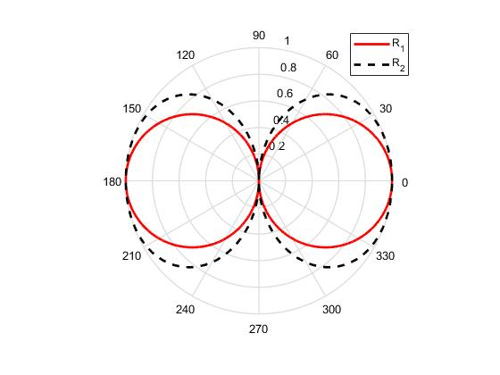
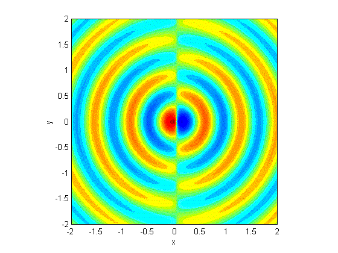
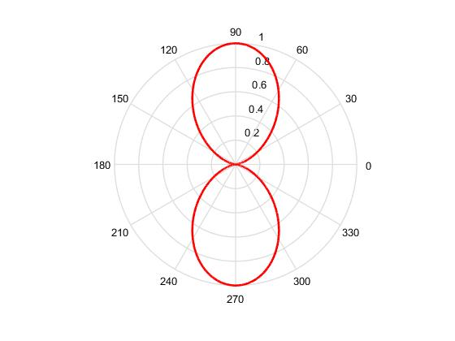
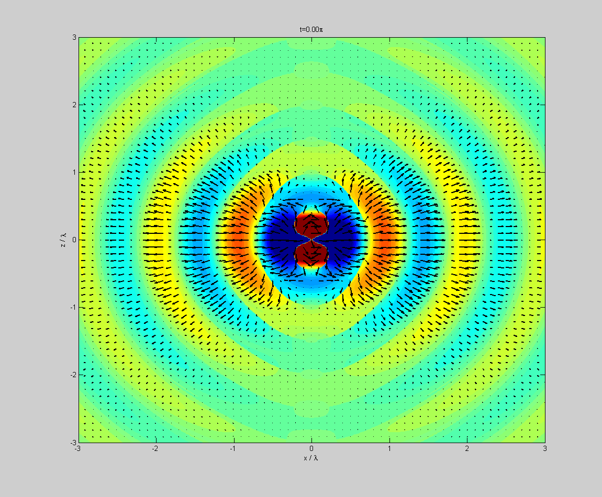

# 28 点声源

## 28.1 点声源的声源强度

> `声源强度`：简谐振动声源排开介质的体积速度的幅值为声源强度，记为 $Q$。

均匀脉动球源，球面振速为 $v_0e^{j \omega t}$，震动面面积为 $4 \pi a^2$，则均匀脉动球源的声源强度为：
$$
Q = 4 \pi a^2 v_0
$$
均匀脉动球源的辐射声压场为：
$$
p(r, t) = \frac{\rho_0 c_0 a v_0 (ka)}{r \cdot \sqrt{1 + (ka)^2}} e^{j(ka + \phi_0)} \cdot e^{j(\omega t - kr)},  \ \ \ \  \ \tan \phi_0 = \frac{1}{ka}
$$
因为 $ka \ll 1$，点声源的声压场可表示为：
$$
p(r, t) = \frac{jk \rho_0 c_0 Q}{4 \pi r} e^{j(\omega t - kr)}
$$
点声源满足两个条件：

**1. 声源尺度远小于介质中的波长；**

**2. 辐射的声场各向均匀。**

点声源速度势可表示为：
$$
\Phi(r, t) = \frac{1}{\rho_0}\int p(r,t)dt = \frac{Q}{4\pi r}e^{j(\omega t - kr)}
$$
**复杂声源的辐射声场均可通过点声源的声场叠加求解。**

## 28.2 声偶极子

> `声偶极子`：两个相距较近，强度相等，振动相位相反的点声源构成的声辐射系统。如下图所示。

### 28.2.1 声偶极子辐射声压场

利用叠加原理求声偶极子辐射场。由于点源的速度势函数如式（4）所示，则点声源1和点声源2的速度势函数分别为：
$$
\Phi_+(r, t) = \frac{Q}{4 \pi r_+}e^{j(\omega t - k r_+)} \\
\Phi_-(r, t) = -\frac{Q}{4 \pi r_-}e^{j(\omega t - k r_-)}
$$
根据叠加原理，声偶极子速度势函数为：
$$
\Phi(r, \theta, t) = \Phi_+(r, \theta, t) + \Phi_-(r, \theta, t) = 
\left[ 
	\frac{Q}{4 \pi r_+}e^{-jkr_+} - \frac{Q}{4 \pi r_-}e^{-jkr_-} 
\right] e^{j \omega t}
$$
根据式（6）, 根据两点间导数的定义， $f(r_+) - f(r_-) \approx f'(r)(r_+ - r_-)$，则式（6）可表示为：
$$
\Phi(r, \theta, t) = 
\left[ 
	\frac{\partial}{\partial r} 
	\left( 
		\frac{Q}{4 \pi r}e^{-jkr}
	\right) (r_+ - r_-)
\right] e^{j \omega t}
$$
根据上图，$r_+ - r_- \approx -d \cos \theta$，定义 $Q_1 = Qd$ 为偶极子距，则声偶极子的速度势函数可表示为：
$$
\Phi(r, \theta, t) = 
\left[ 
	- \frac{Q}{4 \pi}\frac{\partial}{\partial r} 
	\left( 
		\frac{e^{-jkr}}{r}
	\right) d \cos \theta
\right] e^{j \omega t} \\
= \left[ 
	-\frac{Q_1}{4 \pi} \frac{\partial}{\partial r} 
	\left(
		\frac{e^{-jkr}}{r}
	\right) \cos \theta
\right] e^{j \omega t}
$$
声偶极子辐射声压场可表示为：
$$
p(r, \theta, t) = \rho_0 \frac{\partial}{\partial t} \Phi (r, \theta, t) = j \omega \rho_0 \Phi(r, \theta, t) \\ 
= j \omega \rho_0 
\left[
	-\frac{Q_1}{4 \pi} \frac{\partial}{\partial r}
	\left(
		\frac{e^{-jkr}}{r}
	\right) \cos \theta
\right] e^{j \omega t} \\
= \frac{jk\rho_0 c_0 Q_1}{4 \pi r^2} \sqrt{1 + (kr)^2} \cos \theta e^{j(\omega t - kr + \phi)}, \ \ \ \ tan \phi = kr
$$

---

直接通过点声源的声压模型来解：
$$
P(r, \theta, t) = p_+(r, t) + p_-(r, t) \\
= \frac{jk \rho_0 c_0 Q}{4 \pi r}e^{j(\omega t - kr)}
\left[ 
	e^{j(k\frac{d}{2})\cos \theta} - e^{-j(k\frac{d}{2})\cos \theta}
\right] \\
= \frac{jk \rho_0 c_0 Q}{4 \pi r}e^{j(\omega t - kr)} \cdot 2j \sin \left[ \frac{\pi d \cos \theta}{\lambda}\right]
$$

### 28.2.2 声偶极子的指向性

> `指向函数`：在声源辐射声场的远场，以声源为球心的球面上，在各个方向上声场幅值的归一化函数称作声源的指向性函数，记为 $R(\theta, \phi)$。
> $$
> R(\theta, \phi) = \frac{|p(\theta, \phi)|}{|p(\theta_0, \phi_0)|}
> $$
> 其中，$|p(\theta_0, \phi_0)| = max\{|p(\theta, \phi)|\}$。

声偶极子声源的指向性函数：
$$
R_1(\theta, \phi) = \frac{|p(\theta, \phi)|}{|p(\theta_0, \phi_0)|} = |\cos \theta| \\
R_2(\theta, \phi) = \left| \sin \left[ \frac{\pi d \cos \theta}{\lambda}\right] \right|
$$
声偶极子声源的二维指向图如下图所示。

声偶极子的声场如下图所示。

## 28.3 对称声偶极子

> `对称声偶极子`：两个相距较近，强度相等，振动相位相同的点声源构成的声辐射系统。*对称声偶极子的概念是没有的，是作者根据意思自己创造出来的，所以理解意思就可以了。*

声源1和2处的声压表示为：
$$
p_1(r, t) = \frac{jk\rho_0c_0Q}{4 \pi r} e^{j(\omega t - kr_+)}\\
p_2(r, t) = \frac{jk\rho_0c_0Q}{4 \pi r} e^{j(\omega t - kr_-)}
$$
远场声压为：
$$
P(r, t) = p_1(r, t) + p_2(r, t) \\
= \frac{jk\rho_0c_0Q}{4 \pi r}e^{j(\omega t - kr)}\left[ e^{-jk\frac{d}{2}\cos \theta} +  e^{jk\frac{d}{2}\cos \theta}\right] \\
= \frac{jk\rho_0c_0Q}{4 \pi r}e^{j(\omega t - kr)} \cdot 2 \cos\left[\frac{\pi d \cos \theta}{\lambda} \right]
$$
对称声偶极子的二维指向图如下图所示。

对称声偶极子的声场如下图所示。

---

## 附录

由均匀脉动球源的声场推导点声源声场，均匀脉动球源的声场是已知的，如式（2）所示，又因为声源强度如式（1）所示，所以均匀脉动球源的声压场可表示为：
$$
p(r, t) = \frac{\rho_0 c_0 kQ}{4\pi r \cdot \sqrt{1 + (ka)^2}} e^{j(ka + \phi_0)} \cdot e^{j(\omega t - kr)}
$$
当 $ka \ll 1$ 时，取 $ka \to 0$，则 $\lim_{ka \to 0}\sqrt{1 + (ka)^2} = 1$，
$e^{j(ka + \phi_0)} = \cos(ka + \phi_0) + j \sin (ka + \phi_0)$，且 $\phi_0 = \lim_{ka \to 0}\arctan \frac{1}{ka} = \frac{\pi}{2}$，则 $\lim_{ka \to 0} \cos(ka + \phi_0) = 0; \ \lim_{ka \to 0} \sin (ka + \phi_0) = 1$，所以 $\lim_{ka \to 0} e^{j(ka + \phi_0)} = j$，点声源的声压场可表示为式（3）。

