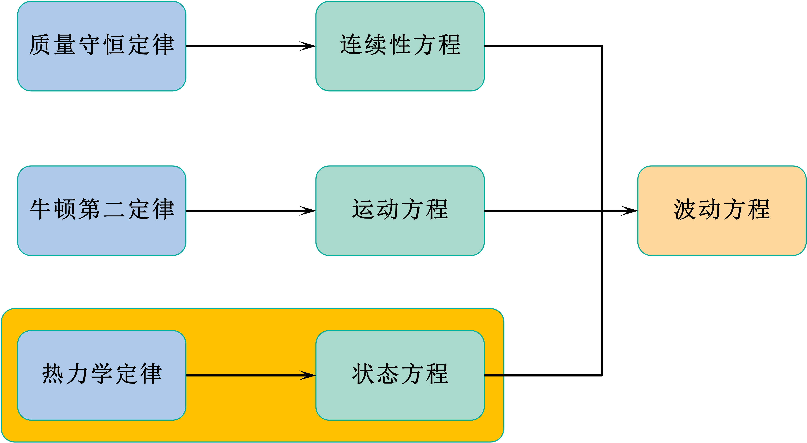

# 7 状态方程

**注意：本节中的所有关于质点振速（矢量场）、密度（标量场）的物理符号都表示场，它们都是空间和时间的函数，为了方便，只写前面的符号，后面关于空间和时间的符号 $(x, y, z, t)$ 省略。**

## 7.1 [等熵绝热过程](https://baike.baidu.com/item/%E7%AD%89%E7%86%B5%E8%BF%87%E7%A8%8B/5138048?fr=aladdin)

$$
PV^\gamma = P_0V_0^\gamma
$$

其中，$\gamma = C_p/C_v$ 表示泊松比，是定压比热与定容比热之比。
$$
P = P_0 \left( \frac{V_0}{V}\right)^\gamma = P_0 \left( \frac{M/\rho_0}{M/\rho} \right)^\gamma = P_0 \left( \frac{\rho}{\rho_0} \right)^\gamma
$$

## 7.2 状态方程推导

在声波的作用下，介质的密度和压强都会发生变化。如果声波的频率较高，质团之间来不及作热交换，整个过程是等熵绝热的过程。

根据热力学定律，质量一定的理想流体中，独立的热力学参数只有三个：**压强（$P$）、密度（$\rho$）和熵值（$s$）**。在声波的作用下，声压 $P_0(\rho_0, s_0)$ 变化到 $P(\rho_t, s_0)$，然后将压强 $P(\rho_t, s_0)$ 在 $(\rho_0, s_0)$ 处泰勒技术展开并保留一阶项：
$$
P(\rho_t, s_0) = P_0(\rho_0, s_0)+ \left. \frac{\partial P}{\partial \rho_t} \right|_{\rho_0, s_0}(\rho_t - \rho_0) + O(\rho_t^2)\\
\Rightarrow p(\rho_t, s_0) \approx \left. \left( \frac{\partial P}{\partial \rho_t} \right) \right|_{\rho_0, s_0} \cdot \rho
$$
设 $c_0 \equiv \sqrt{\left. \left( \frac{\partial P}{\partial \rho_t} \right) \right|_{\rho_0, s_0}}$ 为介质的等熵波速，也叫介质的波速，它是介质的固有性质。则式（3）可以写为：
$$
p=\rho c_0^2
$$
式（4）即为均匀、静止理想流体中小振幅波的状态方程。

## 7.3 体积弹性模量和压缩系数

$$
c_0^2 \equiv \left. \left( \frac{\partial P}{\partial \rho_t} \right) \right|_{\rho_0, s_0}= \frac 1 \rho_0 \cdot \left[ \rho_0 \left. \left( \frac{\partial P}{\partial \rho_t} \right) \right|_{\rho_0, s_0} \right] = \frac{E}{\rho_0}
$$

其中，$E=\rho_0 \left. \left( \frac{\partial P}{\partial \rho_t} \right) \right|_{\rho_0, s_0}$ 表示[体积模量或体积弹性模量](https://baike.baidu.com/item/%E4%BD%93%E7%A7%AF%E6%A8%A1%E9%87%8F/2500973?fr=aladdin)。

体积弹性模量的定义为：
$$
E = - \frac{dP}{dV/V_0}
$$
则
$$
E = - \frac{dP}{d(M/\rho_t)/(M/\rho_0)}=-\frac{dP}{\rho_0d \left( \frac 1 {\rho_t }\right)}
\\ = \frac{dP}{\frac{\rho_0}{\rho_t^2}d(\rho_t)} \approx \rho_0 \frac{dP}{d\rho_t}
$$
体积弹性模量的倒数为压缩系数：
$$
\chi = 1/E = \frac {1}{\rho_0}\frac{\partial \rho_t}{\partial P}
$$
