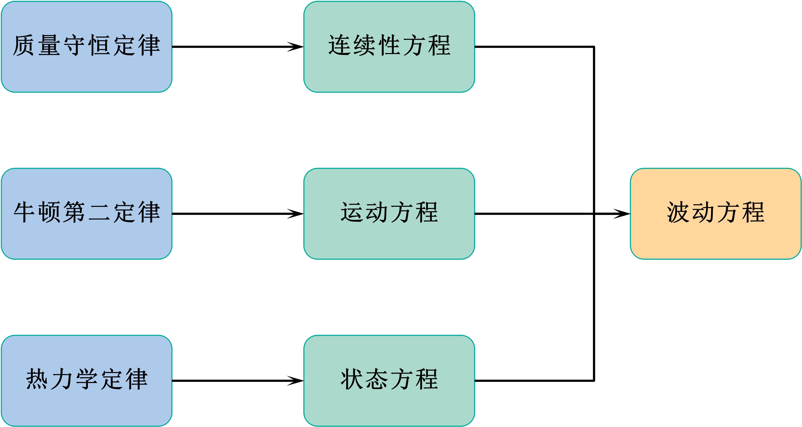

# 8 波动方程

**注意：本节中的所有关于质点振速（矢量场）、密度（标量场）的物理符号都表示场，它们都是空间和时间的函数，为了方便，只写前面的符号，后面关于空间和时间的符号 $(x, y, z, t)$ 省略。**

[连续性方程](./5-连续性方程.md)可表示为
$$
\frac{\partial \rho}{\partial t} + \rho_0 \nabla \cdot \overrightarrow{u} = 0
$$
[运动方程](./6-运动方程.md)可表示为
$$
\rho_0\frac{\partial \overrightarrow{u}}{\partial t}= -\nabla p
$$
[状态方程](./7-状态方程.md)可表示为
$$
p = c_0^2 \rho
$$

## 8.1 声压波动方程推导

通过公式（1）、（2）和（3）可以看出，三个方程分别描述了三个基本声学量中两两的相互关系，所以只需要消除其中的一个变量，即可获得波动方程。

（1）式对 $t$ 求导，$\frac{\partial(1)}{\partial t}$可表示为
$$
\frac{\partial^2 \rho}{\partial t^2} + \rho_0 \frac{\partial}{\partial t}(\nabla \cdot \overrightarrow{u}) = 0
$$
对（2）式求散度，$\nabla \cdot (2)$ 可表示为
$$
\rho_0 \nabla \cdot \frac{\partial \overrightarrow{u}}{\partial t} = -\nabla^2 p
$$
（3）式对 $t$ 求二阶偏导，$\frac{\partial^2 (3)}{\partial t^2}$ 可表示为
$$
\frac{\partial^2 p}{\partial t^2}=c_0^2 \frac{\partial^2\rho}{\partial t^2}
$$

>$\frac{\partial}{\partial t}(\nabla \cdot \overrightarrow{u})$ 和 $\nabla \cdot \frac{\partial \overrightarrow{u}}{\partial t}$，这两者是相等的，因为：
>
>1. 对质点振速求散度 $\nabla \cdot \overrightarrow{u}$：
>
>$$
>\nabla \cdot \overrightarrow{u} = \frac{\partial a_x}{\partial x} + \frac{\partial a_y}{\partial y} + \frac{\partial a_z}{\partial z}
>$$
>
>2. 再求偏导 $\frac{\partial}{\partial t}(\nabla \cdot \overrightarrow{u})$：
>
>$$
>\frac{\partial}{\partial t}(\nabla \cdot \overrightarrow{u}) = \frac{\partial^2 a_x}{\partial x \partial t} + \frac{\partial^2 a_y}{\partial y \partial t} + \frac{\partial^2 a_z}{\partial z \partial t}
>$$
>
>3. 对质点振速先求偏导 $\frac{\partial \overrightarrow{u}}{\partial t}$：
>
>$$
>\frac{\partial \overrightarrow{u}}{\partial t} = \left\{ \frac{\partial u_x}{\partial t}, \frac{\partial u_y}{\partial t}, \frac{\partial u_z}{\partial t} \right\}
>$$
>
>4. 再求散度 $\nabla \cdot \frac{\partial \overrightarrow{u}}{\partial t}$：
>
>$$
>\nabla \cdot \frac{\partial \overrightarrow{u}}{\partial t} = \frac{\partial^2 a_x}{\partial x \partial t} + \frac{\partial^2 a_y}{\partial y \partial t} + \frac{\partial^2 a_z}{\partial z \partial t}
>$$

可以看出，两者是相同的，所以将式（4）、（5）和（6）联立可得波动方程：
$$
\nabla^2 p = \frac{1}{c_0^2}\frac{\partial^2 p}{\partial t^2}
$$

## 8.2 速度势（函数）波动方程

如果运动是无旋的，则质点振速 $\overrightarrow{u}$ 可用标量函数 $\Psi $ 的负梯度表示：
$$
\overrightarrow{u} = -\nabla\Psi
$$
 由运动方程（2），质点振速可以表示为
$$
\overrightarrow{u} = -\frac{1}{\rho_0}\int (\nabla p) dt
$$
而质点振速又可以用（12）式表示，所以
$$
\begin{align}
&\nabla \Psi = \frac{1}{\rho_0} \int (\nabla p) dt \\
\Rightarrow& \rho_0 \nabla \Psi = \int (\nabla p) dt \\
\Rightarrow& \rho_0 \frac{\partial (\nabla \Psi)}{\partial t} = \nabla p \rightarrow \nabla \left( \rho_0 \frac{\partial \Psi}{\partial t} \right) = \nabla p \\
\Rightarrow& p = \rho_0 \frac{\partial \Psi}{\partial t}
\end{align}
$$
然后对（17）式对时间求二阶偏导 $\frac{\partial^2 (17)}{\partial t^2}$：
$$
\frac{\partial ^2p}{\partial t^2} = \rho_0 \frac{\partial ^3 \Psi}{\partial t^3}
$$
将式（18）与式（4）、（6）联立可得速度势（函数）波动方程：
$$
\nabla^2 \Psi = \frac {1}{c_0^2} \frac{\partial ^2 \Psi}{\partial t^2}
$$

## 8.3 密度逾量（函数）波动方程

根据波动方程（3），由声压方程可得密度逾量（函数）波动方程：
$$
\nabla^2 \rho = \frac{1}{c_0^2} \frac{\partial^2 \rho}{\partial t^2}
$$

## 8.4 波动方程的物理意义

**描述声场空间、时间变化规律和相互关系的方程。**