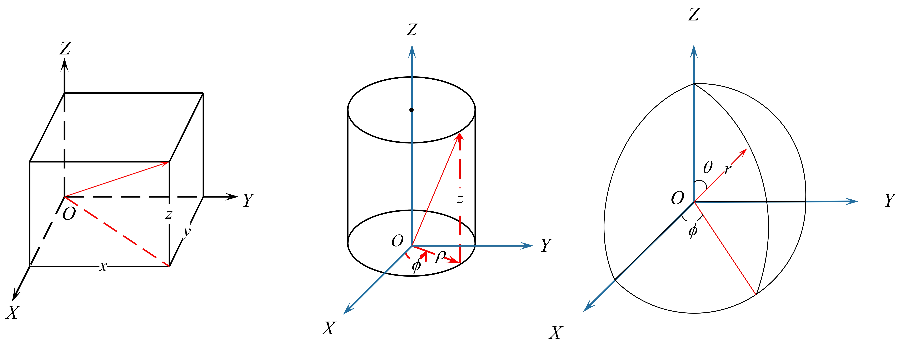
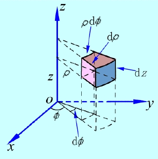
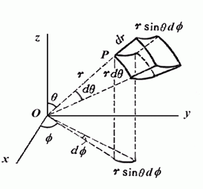

# 9 波动方程在直角坐标系、柱坐标系和球坐标系中的表示

## 9.1 三种坐标系定义

**图中，三种坐标系分别表示：直角坐标系、柱坐标系和球坐标系。**

## 9.2 直角坐标系

直角坐标系是平时使用最多的坐标系，其有三个互相垂直的坐标轴 $X、Y、Z$，三个坐标轴的方向单位向量分别为 $\overrightarrow{e_x}、\overrightarrow{e_y}、\overrightarrow{e_z}$。假设空间中存在任意一点 $\overrightarrow{p}$，则其向量表示为
$$
\overrightarrow{p} = x \cdot \overrightarrow{e_x} + y \cdot \overrightarrow{e_y} + z \cdot \overrightarrow{e_z}
$$
其坐标简化形式为 $(x, y, z)$。

直角坐标系中各面积矢量表示为
$$
d\overrightarrow{S_x} = \overrightarrow{e_x}dl_yl_z = \overrightarrow{e_x} dydz \\
d\overrightarrow{S_y} = \overrightarrow{e_y}dl_xl_z = \overrightarrow{e_y} dxdz \\
d\overrightarrow{S_z} = \overrightarrow{e_z}dl_xl_y = \overrightarrow{e_z} dxdy
$$
由公式 (2) 可得[拉梅系数](https://www.zhihu.com/question/52942733/answer/346870543)
$$
\begin{cases}
dl_x = dx &\Rightarrow& h_x = 1 \\
dl_y = dy &\Rightarrow& h_y = 1 \\
dl_z = dz &\Rightarrow& h_z = 1 \\
\end{cases}
$$
直角坐标系的体积元表示为
$$
dV=dxdydz
$$
直角坐标系中微分元表示为
$$
d\overrightarrow{l} = \overrightarrow{e_x} dx + \overrightarrow{e_y}dy + \overrightarrow{e_z}dz
$$

## 9.3 柱坐标系

柱坐标系是平面极坐标系和直角坐标系的 $Z$ 轴混合而成。坐标使用三个符号表示，分别为：径向距离 $\rho$、方位角 $\alpha$、高度 $z$。假设空间中有一点 $\overrightarrow M$，则在柱坐标系中表示为
$$
\overrightarrow{M} = \overrightarrow{e_\rho} \rho + \overrightarrow{e_z} z
$$
其简化形式为 $(\rho, \phi, z)$。

柱坐标与直角坐标之间的转换关系为
$$
\begin{cases}
x = \rho \cos \phi \\
y = \rho \sin \phi \\
z = z
\end{cases}
$$
柱坐标系中各面积元矢量表示为
$$
dS_\rho = \overrightarrow{e_\rho}dl_\phi dl_z = \overrightarrow{e_\rho}\cdot \rho d\phi dz \\
dS_\phi = \overrightarrow{e_\phi}dl_\rho dl_z = \overrightarrow{e_\phi} \cdot d\rho dz\\
dS_z = \overrightarrow{e_z}dl_\rho dl_\phi = \overrightarrow{e_z} \cdot \rho d\rho d\phi
$$
由公式（8）可得拉梅系数
$$
\begin{cases}
dl_\rho = d\rho &\Rightarrow &h_\rho = 1 \\
dl_\phi = \rho d\phi &\Rightarrow &h_\phi = \rho \\
dl_lz = dz &\Rightarrow &h_z = 1
\end{cases}
$$
柱坐标系的体积元表示为
$$
dV = \rho d\rho d\phi dz
$$
柱坐标系中微分元表示为
$$
d\overrightarrow{r} = \overrightarrow{e_\rho} d\rho + \overrightarrow{e_\phi}\rho d\phi + \overrightarrow{e_z}dz
$$

## 9.4 球坐标系

球坐标系使用 $r、\theta、\phi$ 表示空间中一点 $\overrightarrow{p}$，其在球坐标系中表示为
$$
\overrightarrow p = \overrightarrow {e_r} r
$$
简化表示为 $(r, \theta, \phi)$。

球坐标与直角坐标之间的转换关系为
$$
\begin{cases}
x &= &r \sin \theta \cos \phi \\
y &= &r \sin \theta \sin \phi \\
z &= &r \cos \theta
\end{cases}
$$
球坐标系中各面积元矢量表示为
$$
dS_r = \overrightarrow r dl_\theta dl_\phi = \overrightarrow{r} \cdot r^2 \sin \theta d\theta d\phi \\
dS_\theta = \overrightarrow{\theta} dl_r dl_\phi = \overrightarrow{\theta} \cdot r \sin \theta dr d\phi \\
dS_\phi = \overrightarrow{\phi} dl_r dl_\theta = \overrightarrow{\phi} \cdot r dr d\theta
$$
由公式（14）可得拉梅系数
$$
\begin{cases}
dl_r = dr &\Rightarrow & h_r = 1 \\
dl_\theta = r d\theta &\Rightarrow & h_\theta = r \\
dl_\phi = r \sin \theta d\phi &\Rightarrow & h_\phi = r \sin \theta
\end{cases}
$$
球坐标系的体积元表示为
$$
dV = r^2 \sin \theta dr d\theta d\phi
$$
球坐标系中微分元表示为
$$
d\overrightarrow{r} = \overrightarrow{e_r} \cdot dr + \overrightarrow{e_\theta} \cdot rd\theta + \overrightarrow{e_\phi} \cdot r\sin \theta d\phi
$$

## 9.5 声压波动方程在三种坐标系中的表示

在一般正交曲线坐标系中，$\nabla^2 f$ 的展开式为
$$
\nabla^2 f = \frac 1 {h_1 h_2 h_3} \left[ \frac{\partial}{\partial u_1} \left( \frac{h_2 h_3}{h_1} \frac{\partial f}{\partial u_1} \right) + \frac{\partial}{\partial u_2} \left( \frac{h_1 h_3}{h_2} \frac{\partial f}{\partial u_2} \right) + \frac{\partial}{\partial u_3} \left( \frac{h_1 h_2}{h_3} \frac{\partial f}{\partial u_3} \right) \right]
$$
在直角坐标系中，拉普拉斯算符表示为
$$
\nabla^2 = \frac{\partial ^2}{\partial x^2} + \frac{\partial^2}{\partial y^2} + \frac{\partial^2}{\partial z^2}
$$
在柱坐标系中，拉普拉斯算符表示为
$$
\nabla^2 = \frac 1 \rho \frac{\partial }{\partial \rho} \left( \rho \frac{\partial}{\partial \rho} \right) + \frac 1 {\rho^2} \frac{\partial^2}{\partial \phi^2} + \frac{\partial^2}{\partial z^2}
$$
在球坐标系中，拉普拉斯算符表示为
$$
\nabla^2 = \frac{1}{r^2}\frac{\partial}{\partial r} \left( r^2 \frac{\partial}{\partial r} \right) + \frac{1}{r^2 \sin \theta} \frac{\partial}{\partial \theta} \left( \sin \theta \frac{\partial}{\partial \theta} \right) + \frac{1}{r^2}\frac{1}{\sin^2 \theta} \frac{\partial^2}{\partial \phi^2}
$$
