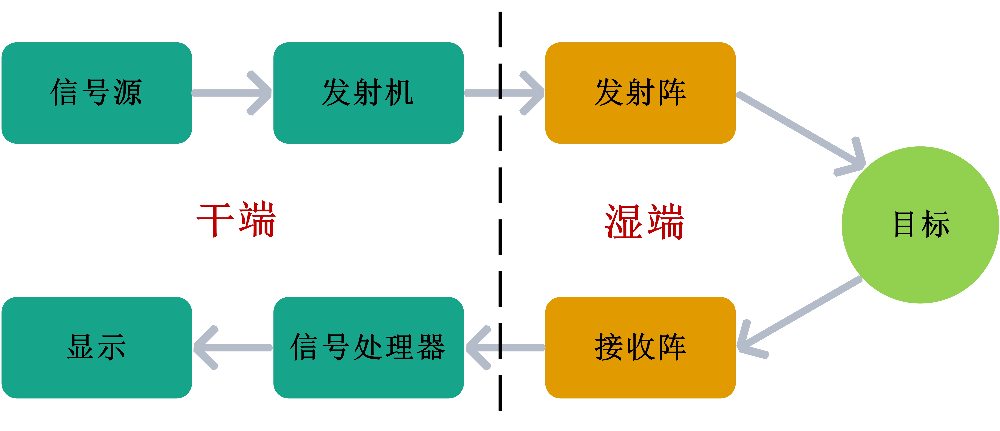
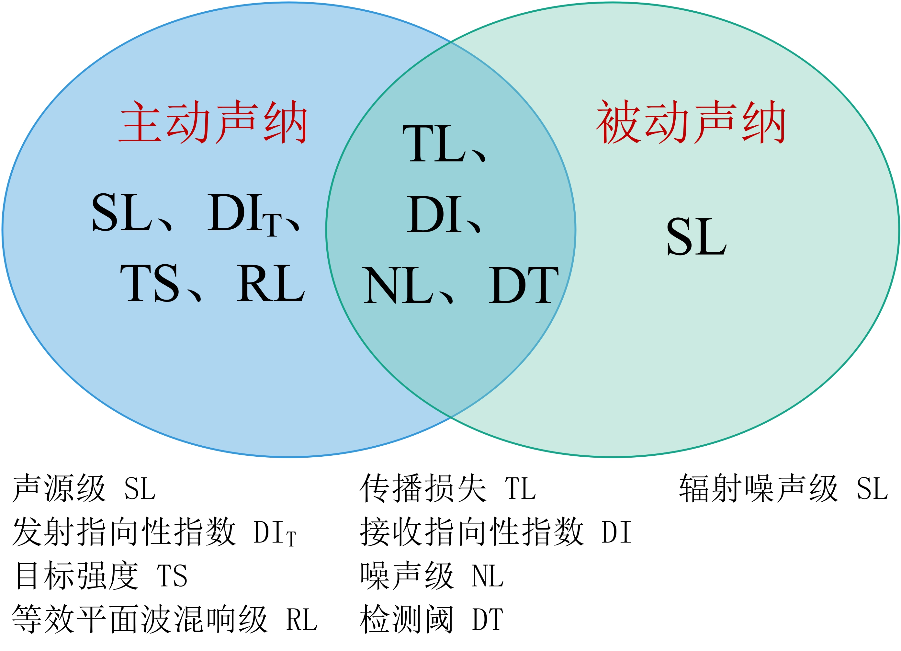
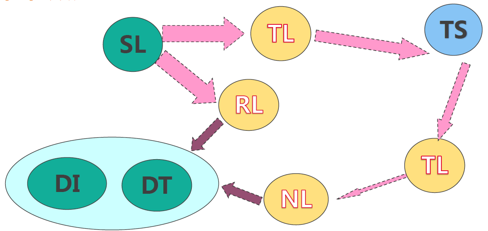
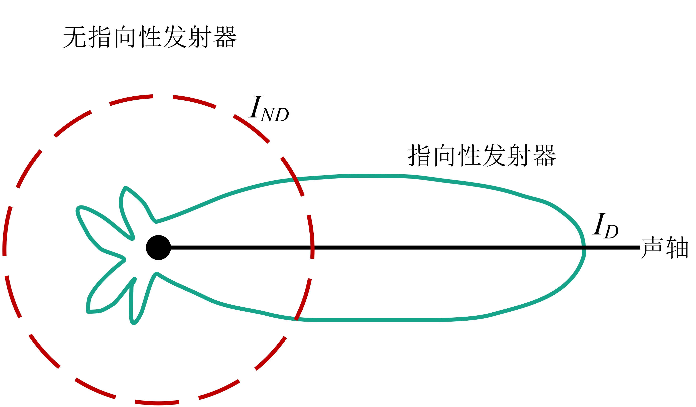
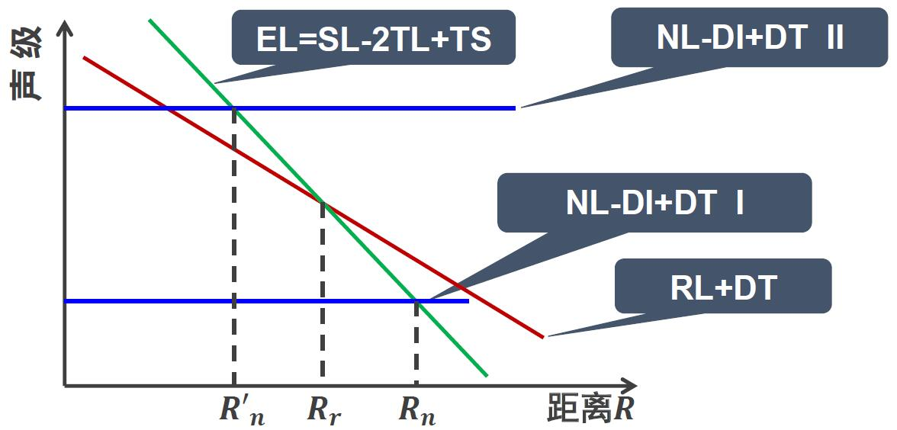

# 2 声呐系统及声呐参数

## 2.1 声呐系统

> [`声纳系统`](https://baike.baidu.com/item/%E5%A3%B0%E7%BA%B3%E7%B3%BB%E7%BB%9F/7746321?fr=aladdin)：利用声波对水下物体进行探测、定位、识别的方法及所用设备的总称。
>
> 声纳系统大致可分为两类：主动声纳(Active Sonar)、被动声纳(Passive Sonar)。

`主动声呐`：通过主动发射声波并接收回波实现探测、定位和目标识别的声纳。其工作流程如图1所示。




<center><b>图1 主动声呐工作流程</b></center>

`被动声纳`：被动接收目标噪声辐射声波实现探测、定位和目标识别的声纳。其工作流程如图2所示。


<center><b>图2 被动声呐工作流程</b></center>

## 2.2 声呐参数

> `声纳参数`：影响声纳设备工作的因素。

声纳参数从能量角度描述了海水介质、声纳目标和声纳设备的特性和效应。





<center><b>图3 声呐参数之间的联系图</b></center>

### 2.2.1 声源级——SL(Source Level)

> `声源级`：声轴上距声源 $1\mathrm{m}$ 处产生的声强相对于参考声强的分贝数。
>
> 用来描述主动声纳所发射声信号的强弱。反应发射器辐射声功率的大小。

数学定义为：
$$
SL = \left. 10 \lg \frac{I}{I_0} \right|_{r = 1}
$$
其中，$I_0$ 表示参考声强，计算方法为：$I_0 = \frac{p_0^2}{\rho_0 c_0} = \frac{10^{-12}}{1.5 \times 10^6} = 6.67 \times 10^{-19} \ \mathrm{W/m^2}$。

### 2.2.2 发射指向性指数——$\mathrm{DI_T}$(Directivity Index)

> `发射指向性指数`：在相同距离上，指向性发射器声轴上的声强级高出无指向性发射器辐射声场声强级的分贝数。
> `发射指向性指数`指示了声能的集中程度，`发射指向性指数`越大，声能越集中。

数学定义为：
$$
DI_T = 10 \lg \frac{I_D}{I_{ND}} = SL_D - SL_{ND}
$$


<center><b>图4 发射指向性指数示意图</b></center>

### 2.2.3 目标强度——TS(Target Strength)

> `目标强度`：在目标到主动声纳接收换能器的方向上距目标声学中心 $1\mathrm{m}$ 处，由目标反向散射产生的声强相对于入射平面波声强的分贝数。描述目标声反射本领大小的物理量。

数学定义为：
$$
TS = 10 \lg \left. \frac{I_r}{I_i} \right|_{r = 1}
$$


<center><b>图5 目标强度示意图</b></center>

### 2.2.4 等效平面波混响级——RL(Reverberation Level)

> `等效平面波混响级`：强度已知的平面波轴向入射到水听器上，水听器输出电压值为 $V$；将水听器移置于混响场中，声轴指向目标，水听器输出电压值为 $V$，则该平面波的声级就是混响级。
> `等效平面波混响级`定量描述混响干扰的强弱。

数学定义为：
$$
RL = 10 \lg \left. \frac{I_{平面波}}{I_0} \right|_{V_p = V_R}
$$

```markdown
主动声纳背景干扰主要包括两部分：
1. 环境噪声：平稳的、各向同性的；
2. 混响：非平稳的、非各向同性的。
```

### 2.2.5 传播损失——TL(Transmission Loss)

> `传播损失`：距声源 $1\mathrm{m}$ 处的声强相对于目标或接收点处声强的分贝数。
> `传播损失`定量描述声波传播一定距离后声强的衰减变化。

数学定义为：
$$
TL = 10 \lg \frac{I_1}{I_r}
$$

### 2.2.6 海洋环境噪声级——NL(Noise Level)

> `海洋环境噪声级`：测量带宽内(或 $1\mathrm{Hz}$ 带宽内)的噪声强度。
> `海洋环境噪声级`用来度量噪声强弱。

数学定义为：
$$
NL = 10 \lg \frac{I_N}{I_0}
$$

### 2.2.7 接收指向性指数——DI(Directivity Index)

> `接收指向性指数`：在指向性水听器的轴向灵敏度等于无指向性水听器的灵敏度条件下，无指向性水听器的输出噪声功率相对于指向性水听器输出噪声功率的分贝数。
> `接收指向性指数`指示接收系统抑制各向同性背景噪声的能力。

数学定义为：
$$
DI = 10 \lg \frac{无指向性水听器的输出噪声功率}{指向性水听器输出噪声功率}
$$

#### 2.2.7.1 水听器灵敏度

> `水听器灵敏度`：水听器处的声压为 $P$（单位：微帕），装置的开路终端电压为 $V$（单位：伏），则水听器的灵敏度定义为：
> $$
> S_h = 20 \lg \frac{V}{P} \ \ \mathrm{dB/V}
> $$
> `水听器灵敏度`反应水听器的声电转换能力。

#### 2.2.7.2 无指向性水听器的输出噪声功率

假设水听器的声电转换系数为 $m$，噪声场为各向同性，单位立体角内的噪声功率为 $I_i$，则无指向性水听器的输出噪声功率为：
$$
R_N = m \int_{4 \pi}I_i d \Omega = 4 \pi m I_i
$$

#### 2.2.7.3 指向性水听器的输出噪声功率

$$
R_D = m \int_{4 \pi} I_i b(\theta, \phi) d \Omega = m I_i \int_{4 \pi} b(\theta, \phi) d \Omega
$$

#### 2.2.7.4 接收指向性指数

$$
DI = 10 \lg \frac{R_N}{R_D} = 10 \lg \frac{4 \pi}{\int_{4 \pi}b(\theta, \phi)d \Omega}
$$

1. 参数 $DI$ 只对各向同性噪声场中的平面波信号有意义；
2. 对于其他具有方向特性的信号场和噪声场，需要使用阵增益来代替 $DI$。

### 2.2.8 检测阈 —— DT (Detection Threshold)

> `检测阈`：声纳接收机为达到指定的检测性能所需要的处理器输入端信噪比的分贝值。
> `检测阈`指示设备刚好能正常工作所需处理器输入端的信噪比。

数学定义为：
$$
DT = 10 \lg \frac{S}{N}
$$
**对于同种职能的声纳设备，检测阈值较低的设备，其处理能力也较强，性能也较好。**

## 2.3 组合声呐参数

> `组合声纳参数`：具有明确物理含义的声纳参数组合量。

### 2.3.1 回声信号级

`回声信号级`表示为：
$$
SL - 2TL + TS
$$
`回声信号级`的物理意义为：**主动声纳接收换能器接收到的回声信号的声强级。**

### 2.3.2 噪声掩蔽级

`噪声掩蔽级`表示为：
$$
NL - DI + DT
$$
`噪声掩蔽级`的物理意义为：**工作在噪声干扰中的声纳设备正常工作所需要的最低信号级**。

### 2.3.3 混响掩蔽级

`混响掩蔽级`表示为：
$$
RL + DT
$$
`混响掩蔽级`的物理意义为：**工作在混响干扰中的主动声纳正常工作所需要的最低信号级**。

### 2.3.4 回声余量

`回声余量`表示为：
$$
SL - 2TL + TS - (NL - DI + DT)
$$
`回声余量`的意义为：**主动声纳回声级超过噪声掩蔽级的数量**。

### 2.3.5 优质因数

`优质因数`表示为：
$$
SL - (NL - DI + DT)
$$
`优质因数`的物理意义：
1. **对于被动声纳，该量规定了最大允许单程传播损失；**
2. **对于主动声纳，当 $TS = 0$，该量规定了最大允许双程传播损失。**

### 2.3.6 背景干扰级

`背景干扰级`表示为：
$$
NL - DI
$$
`背景干扰级`的物理意义为：**接收指向性指数压低背景噪声的量**。

### 2.3.7 品质因数

`品质因数`表示为：
$$
SL - (NL - DI)
$$
`品质因数`的意义为：**接收阵测得的声源级与噪声干扰级之差。**

### 2.3.8 回声级、噪声掩蔽级、混响掩蔽级与距离的关系



<center><b>图6 回声级、噪声掩蔽级、混响掩蔽级与距离的关系图</b></center>

根据图6，可得以下结论：
**1. 回声和混响都是随距离而衰减的而噪声保持不变。回声曲线随距离下降比混响掩蔽级曲线要快，二者相交于混响限制距离 $R_r$ 处 。而回声曲线与噪声掩蔽级曲线相交于噪声限制距离 $R_n$ 处 。**
**2. 对于噪声掩蔽级 $\mathrm{I}$，$R_r < R_n$，声纳设备正常工作的距离 $R < R_r$，因此声纳作用距离受混响限制，此时==混响为主要干扰==。**
**3. 对于噪声掩蔽级 $\mathrm{II}$，$R_n^{'} < R_r$，而声纳设备正常工作的距离 $R < R_n^{'}$，因此声纳作用距离受噪声限制，此时==噪声为主要干扰==。** 


---


## 附录

###  附录1 已知声功率，如何计算SL？

对于无指向性点声源，其距离声源中心 $1\mathrm{m}$ 处的声强 $I_{ND}$表示为：
$$
\left. I_{ND} \right|_{r = 1} = \frac{P_a}{4 \pi} \ \ \mathrm{W/m^2}
$$
则无指向性声源的声源级为：
$$
SL_{ND} = 10 \lg P_a + 170.77
$$
指向性声源的声源级表示为：
$$
SL_D = 10 \lg P_a + 170.77 + DI_T
$$
